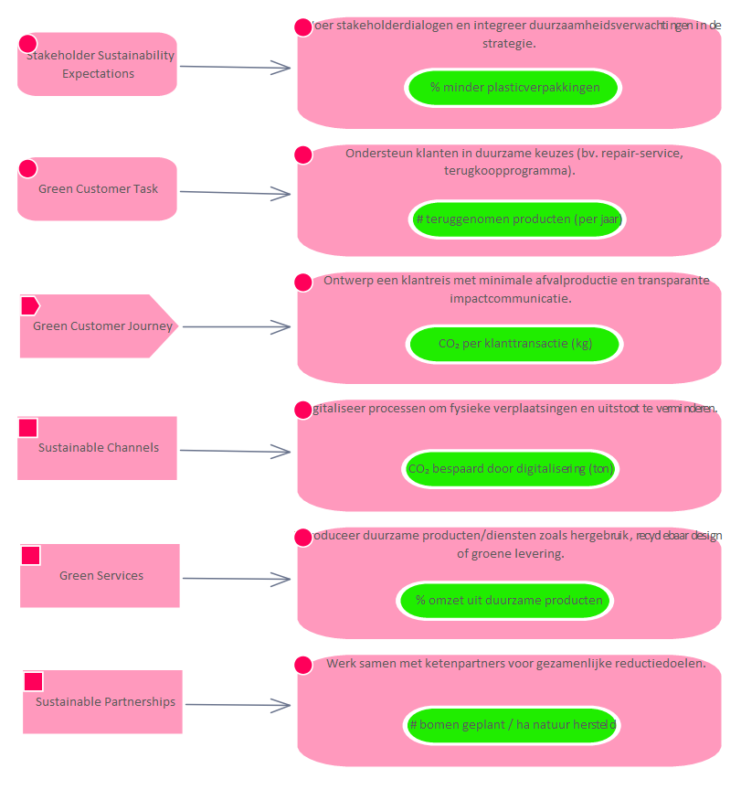

# Task Digitaliseer processen om fysieke verplaatsingen en uitstoot te verminderen.

**Type:** Activity  **Stereotype:** Task  **StereotypeEx:** Task  **FQStereotype:** EDGY::Task  
**Status:** Proposed<button class="ea-status-edit-btn" type="button" aria-label="Edit status">&#9998;</button>  
**Created:** 2025-12-02  **Modified:** 2025-12-15

[Home](../index.html) / [Edgy](../Edgy/index.html) / [Experience](../Experience/index.html) / [Task](index.html)

<button id="ea-notes-edit-btn" class="ea-notes-edit-btn" type="button" aria-label="Edit notes">&#9998;</button>

<!--ea-notes-start-->

<!--ea-notes-end-->

## Tagged Values

<table>
<thead><tr><th>Name</th><th>Value</th><th>Notes</th></tr></thead>
<tbody>
<tr><td>EDGY::TextAlign</td><td>Top</td><td><!--ea-row-notes-start:tag-0-->
Default: Center
<!--ea-row-notes-end:tag-0--><button class="ea-row-notes-edit-btn" type="button" data-surface="table-row" data-row-id="tag-0" data-notes-hash="5cc00a1f" data-kind="tagged-value" data-el-id="147" data-tag-name="EDGY::TextAlign" data-tag-value="Top" data-file-path="Task/Digitaliseer processen om fysieke verplaatsingen en uitstoot te verminderen..md" data-api-port="8001" data-api-token="f71e4831faa78932c4078d4ddf7941b1141fc3d544ee504f" aria-label="Edit description">&#9998;</button></td></tr>
<tr class="ea-row-edit" data-row-id="tag-0" style="display:none"><td colspan="3"></td></tr>
</tbody>
</table>

[↑ Back to top](#)

## Relationships

| Type | Stereotype | Connected To |
|------|------------|-------------|
| ControlFlow | Flow | [Sustainable Channels](../Channel/Sustainable Channels.html) |
| Association | Link | [CO₂ bespaard door digitalisering (ton)](../Metrics/CO₂ bespaard door digitalisering (ton).html) |

[↑ Back to top](#)

### Appears on Diagrams

  <a href="../Experience/diagrams/Experience.html" class="diagram-thumb">Experience</a>

[↑ Back to top](#)

### Referenced By

| Type | Stereotype | Source |
|------|------------|--------|
| ControlFlow | Flow | [Sustainable Channels](../Channel/Sustainable Channels.html) |

[↑ Back to top](#)

---

## Relationship Graph

---

*Generated: 2026-08-03 10:55:46*